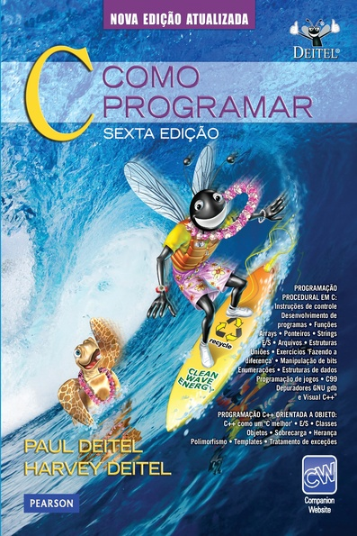
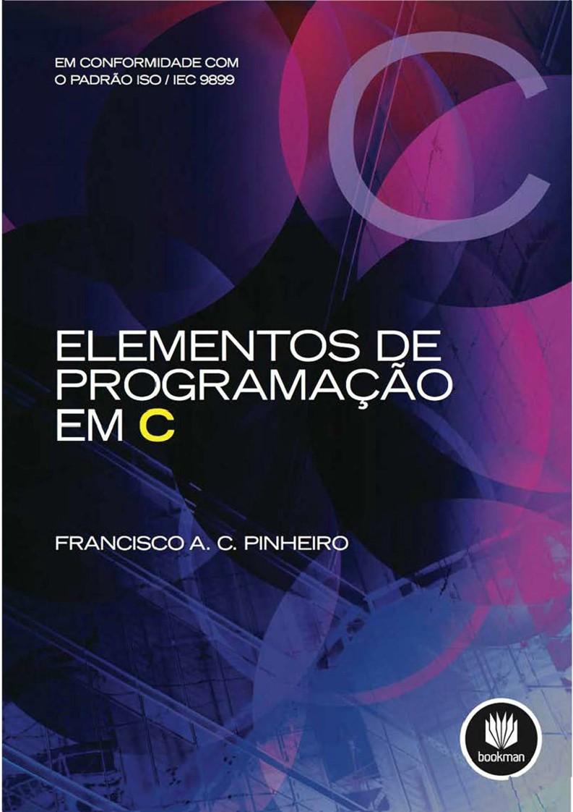
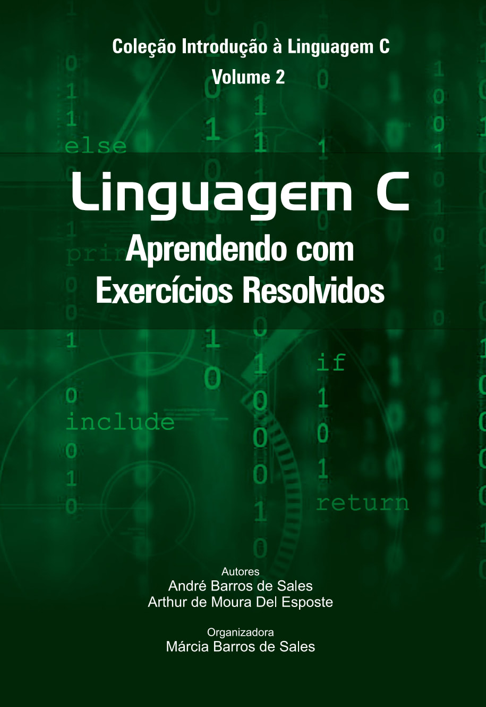
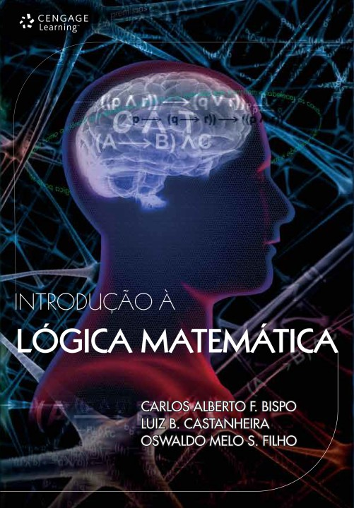
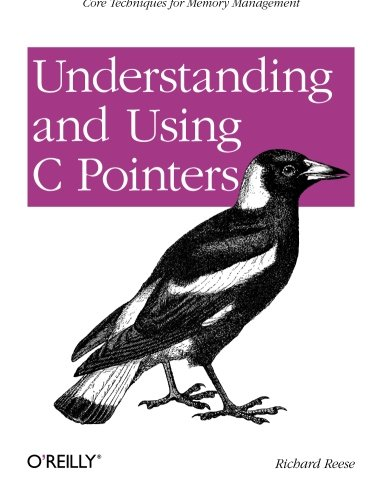
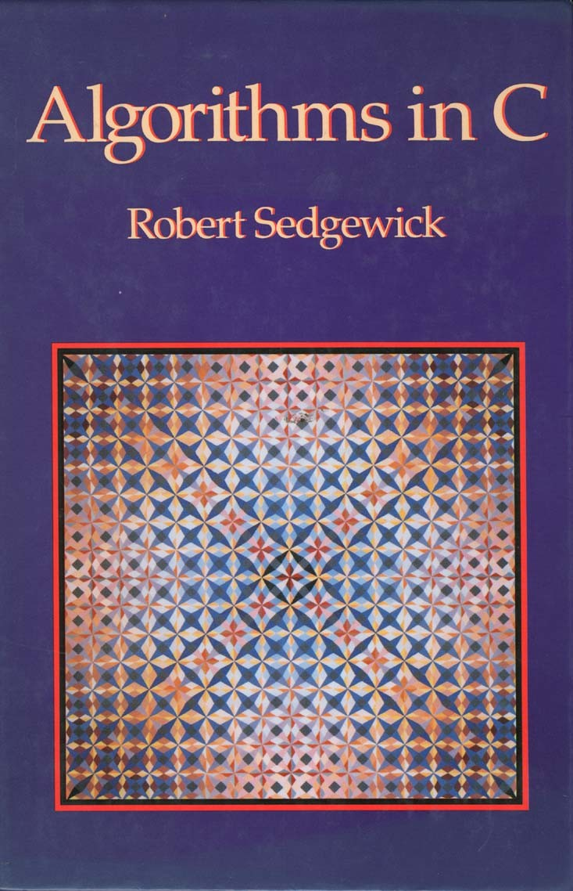
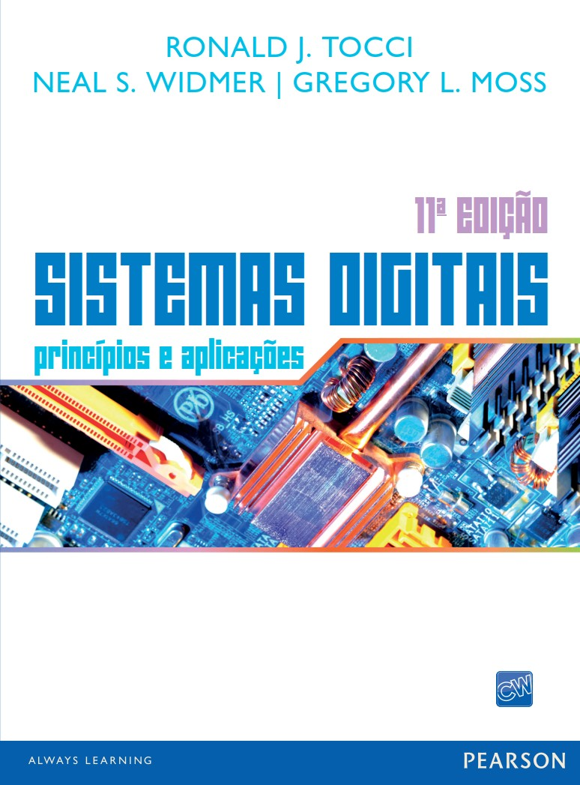

<h1 align="center">
Introdução à Programação
</h1>
<h4 align="center">
Prof. Eduardo Ono
</h4>

 

  

 

## Descrição

Introdução a algoritmos, lógica de programação e linguagem de programação C.

 

## [Conteúdo Programático](./conteudo/README.md)

| Aula | Data | Descrição |
| :-: | :-: | --- |
| [01] | 14/02 | Introdução à Programação
| [02] | 21/02 | Overview de Arquitetura e Organização de Computadores; Criação do Ambiente de Desenvolvimento para Programação em C
| [03] | 07/03 | Primeiro programa em C; Tabela ASCII
| [04] | 14/03 | Tipos de Dados; Variáveis; Operadores Aritméticos
| [05] | 21/03 | Álgebra dos Inteiros
| [06] | 28/03 | Estruturas de Seleção: `if`, `if..else`, Comando Ternário e `switch`
| [07] | 04/04 | Identificação de padrões ("patterns")
| [08] | 11/04 | Exercícios de Fixação
| [09] | 18/04 | __1a. Avaliação__
| [10] | 25/04 | Estruturas de Repetição: `for`, `while`, `do-while`
| [11] | 02/05 | Funções definidas pelo usuário;
| [12] | 09/05 | Ponteiros; Passagem de parâmetros por valor e por referência
| [13] | 16/05 | Vetores
| [14] | 23/05 | Strings
| [15] | 30/05 | __2a. Avaliação__ (Data a ser confirmada)

[01]: ./aulas/README.md#aula-01
[02]: ./aulas/README.md#aula-02
[03]: ./aulas/README.md#aula-03
[04]: ./aulas/README.md#aula-04
[05]: ./aulas/README.md#aula-05

 

## Pré-Requisitos

* Matemática Discreta
* Álgebra dos Inteiros (Opcional)
* Arquitetura e Organização de Computadores

 

## Recursos

* Editor de Fluxogramas: [Flowgorithm](./conteudo/01-ambiente-de-desenvolvimento/README.md)

* Compilador: [GCC](./conteudo/01-ambiente-de-desenvolvimento/README.md)

* Editor/IDE: [Microsoft Visual Studio Code (VS Code)](./conteudo/01-ambiente-de-desenvolvimento/README.md#microsoft-visual-studio-code-vs-code)

  * https://code.visualstudio.com/shortcuts/keyboard-shortcuts-windows.pdf

* [Tabela ASCII](https://theasciicode.com.ar/)

* [Checklist](./conteudo/00-overview/checklist.md)

 

## Material de Apoio

| Thumb | Descrição |
| --- | --- |
|  | [Professor Rafael Ivo] [Programação em C](https://www.youtube.com/playlist?list=PLvat2X-KHJNZwUCeTeve_S1qqrBOWhaU9) (14 vídeos, YouTube, Nov/2020)
|  | [Bóson Treinamentos] [Curso de Programação em Linguagem C](https://www.youtube.com/playlist?list=PLucm8g_ezqNqzH7SM0XNjsp25AP0MN82R) (25 vídeos, YouTube, Jul/2021)

 

## Bibliografia Básica

| Capa | Descrição |
| :-: | --- |
|  | <a id="DEITEL-6e_2011">[DEITEL-6e_2011]</a> DEITEL, P. J.; DEITEL, H.; <strong>C: Como Programar, 6 ed.</strong>, São Paulo : Pearson Prentice Hall, 2011[.](https://app.box.com/s/orpgcu86l21fflmxiqmzdq0cod300i4b) https://www.bvirtual.com.br/NossoAcervo/Publicacao/2660
|  | <a id="PINHEIRO_2012">[PINHEIRO_2012]</a> PINHEIRO, Francisco A. C.; <strong>Elementos de Programação em C</strong>, Porto Alegre : Bookman, 2012.
|  | [SALES_2017] SALES, A. B.; DEL ESPOSTE, A. M. <strong>[Linguagem C: Aprendendo com Exercícios Resolvidos](https://archive.org/details/livro-linguagem-caprendendo-exercicios-resolvidos-2)</strong>, Florianópolis : UFSC, 2017.

 

## Bibliografia Complementar

| Capa | Descrição |
| :-: | --- |
|  | [BISPO_2011] BISPO, Carlos Alberto Ferreira; CASTANHEIRA, Luiz Batista; SOUZA FILHO, Oswaldo Melo; __Introdução à Lógica Matemática__, Cengage Learning, 2011[.](https://app.box.com/s/xfv52p02w3bi0s9pnvkf4not5eoaozh5)
|  | [REESE_2013] REESE, Richard. __Understanding and Using C Pointers__, O'Reilly Media, 2013[.](https://app.box.com/s/cbp98oofhokip0yki3gh7khz6zb6htgq)
|  | [SEDGEWICK_1990] SEDGEWICK, Robert. __Algorithms in C__, Addison-Wesley, 1990.
|  | [TOCCI-11e_2011] TOCCI, Ronald J. __Sistemas Digitais: Princípios e Aplicações, 11. ed.__, São Paulo: Pearson Prentice Hall, 2011.

 

## Vídeos Recomendados

| Thumb | Título |
| --- | --- |
|  | [Glauco Copeck XYZ] [COMO ESTUDAR E APRENDER - Prof Pier](https://www.youtube.com/watch?v=noXqEGIZak8) (23:23, YouTube, Jan/2020)
|  | [Fabio Akita] [Guia DEFINITIVO de Aprendendo a Aprender \| A maior BRONCA da sua vida [RATED R]](https://www.youtube.com/watch?v=oUPaJxk6TZ0) (1:04:37, YouTube, Abr/2020)
|  | [CACiC FCT-Unesp] [Bate-papo com Fabio Akita](https://www.youtube.com/watch?v=i_STkDJ3z5s) (1:42:40, YouTube, Mar/2022)
|  | [Bóson Treinamentos] [O que é preciso para ser um bom programador de computadores?](https://www.youtube.com/watch?v=ED2aoLnr0oA) (19:03, YouTube, Mai/2017)
|  | [Filipe Deschamps] [50 Dicas Essenciais Que Todo Programador Deveria Saber](https://www.youtube.com/watch?v=2xoJjEgecZM) (11:10, YouTube, Out/2020)

 

## Filmes e Documentários Recomendados

| Thumb | Descrição |
| :-: | --- |
|  | __The Imitation Game__ (2014) / O Jogo da Imitação Trailer legendado: https://www.youtube.com/watch?v=YIkKbMcJL_4
|  | [__The Man Who Knew Infinity__](https://www.youtube.com/watch?v=8WwLPep9xNg) (2015) / O Homem que Viu o Infinito (1:48:35, YouTube, Jan/2020)

 
