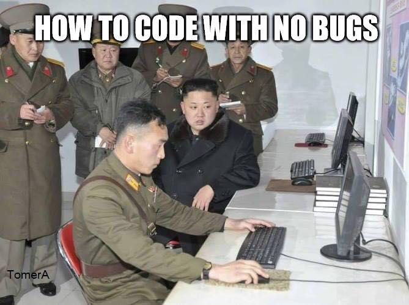

# Introdução à Programação

Prof. Eduardo Ono

 

## Descrição

 

## Conteúdo Programático

| Aula | Data | Conteúdo |
| :-: | :-: | --- |
| 01 | | Conceito de Algoritmos e Programação de Computadores
| 03 | | Tipos de Dados e Variáveis
| 04 | | Operadores Aritméticos, Lógicos e Relacionais; Álgebra dos Inteiros;
| 04 | | Estruturas Sequenciais
| 05 | | Álgebra Booleana
| 06 | | Estruturas de Decisão: if, if-else, switch
| 07 | | Estruturas de Repetição: for, while, do-while
| 08 | | Vetores (Arrays)
| 09 | | Funções definidas pelo usuário
| 10 | | Ponteiros/Apontadores
| 11 | | Passagem de parâmetros por valor e por referência
| 12 | | Strings
| 13 | | Arquivos

 

## Vídeos Recomendados

* [3Blue1Brown] [Tips to be a better problem solver [Last lecture] | Lockdown math ep. 10](https://www.youtube.com/watch?v=QvuQH4_05LI) (YouTube, 1:08:19)

 

## Bibliografia

* [DEITEL_2011] DEITEL, P. J.; DEITEL, H. [C: Como Programar, 6 ed.](https://plataforma.bvirtual.com.br/Acervo/Publicacao/2660), São Paulo: Pearson Prentice Hall, 2011.

 

## Bibliografia Complementar
