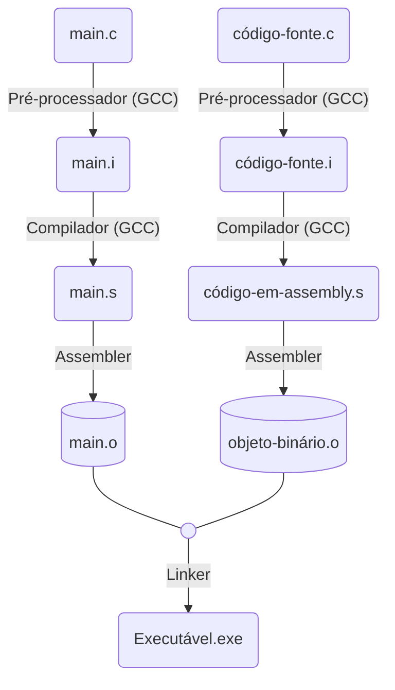

<table>
<tr>
<td align="left" width="8000">
    <small><a href="https://github.com/eduardo-ono/Introducao-a-Programacao">Introducao à Programacao</a> > Conteúdo > Ambiente de Desenvolvimento</small>
</td>
<td align="right">
    <small>Atualizado&nbsp;em:&nbsp;15/04/2022</small>
</td>
</tr>
</table>

<br>

<h1 align="center">
GCC (GNU Compiler Collection)
</h1>
<h4 align="center">
Prof. Eduardo Ono
</h4>

<br>

## Conceitos



<br>

* Para manter os arquivos intermediários (".i", ".s" e ".o") após a compilação, utilizar o parâmetro `-save-temps`:

  ```
  gcc -save-temps main.c -o main
  ```

* Para visualizar todo processo de compilação, utilizar o parâmetro `-v`:

  ```bash
  gcc -v main.c -o main
  ```

<br>

## Linhas de Comando (PowerShell)

* Localizar o arquivo executável do GCC:

```ps
Get-Command gcc.exe
```

```ps
gcm gcc.exe
```

* Exibir a Versão do GCC:

```ps
gcc --version
```

### Compilar programas em C

* Exemplos:

| Comando | Descrição |
| --- | --- |
| ```gcc main.c``` | Compila o arquivo `main.c` e gera o arquivo executável `a` (Linux) ou `a.exe` (Windows).
| `gcc -Wall main.c` | Compila o arquivo `main.c` e gera o arquivo executável `a` (Linux) ou `a.exe` (Windows).  O parâmetro `-Wall` habilita a exibição de todos os alertas ("warnings") da compilação.
| `gcc main.c -o main` | Compila o arquivo `main.c` e gera o executável `main` (Linux) ou `main.exe` (Windows). 
| `gcc -Wall -c main.c` | Compila o arquivo `main.c` e gera o arquivo `main.o` (objeto binário).
| `gcc -Wall -c *.c` | Compila todos os arquivos com extensão ".c" no diretório corrente, gerando os respectivos arquivos ".o" (objetos binários).

<br>

## Videos de Apoio

| Thumb | Descrição |
| :-: | --- |
| [](https://www.youtube.com/watch?v=kE5Mfgc3Dls) | <sup>[Rodrigo Mello]</sup><br>[__Compilação e Linkagem em Linguagem C__](https://www.youtube.com/watch?v=kE5Mfgc3Dls)<br><sub>(7:00, YouTube, Mar/2015)</sub>

<br>
