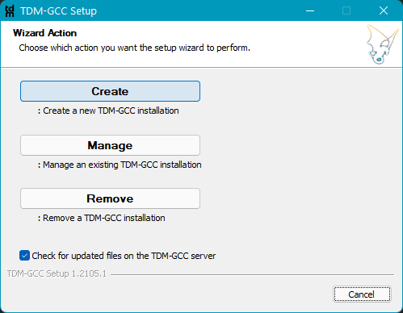

> <h5><a href="https://github.com/eduardo-ono/Introducao-a-Programacao">Introducao à Programacao</a> > Conteúdo</h5>

# Ambiente de Desenvolvimento - Pen Drive

Prof. Eduardo Ono

<br>

## Compilador TDM-GCC (Windows)

### Download e Instalação (Versão atual)

* #### Download

  * Fazer o download do arquivo instalador `tdm64-gcc-10.3.0-2.exe` (MinGW-w64 based), ou a versão mais atual, no site oficial:

    * https://jmeubank.github.io/tdm-gcc/

* #### Instalação

  * Executar o instalador. Na primeira tela, selecionar a opção `Create`:

  <p align="center"></p>

  * Na segunda tela, escolher um diretório para instalação de aplicativos (no exemplo `Apps`) no Pen Drive. Manter o nome do diretório de instalação `TDM-GCC-64`:

  <p align="center"></p>

  * Na quarta tela, __DESMARCAR__ as duas últimas opções `Start Menu Items` e `Add to PATH`:

  <p align="center"></p>

  * Continuar com a instalação com as opções "default".

### Download e Instalação (Versões antigas do TDM-GCC)

* Download

  * Fazer o download do arquivo instalador:

    * [`tdm64-gcc-9.2.0.exe`](https://github.com/jmeubank/tdm-gcc/releases/download/v9.2.0-tdm64-1/tdm64-gcc-9.2.0.exe) (2019)<br><sub>SHA256: `8385fdd88e68a4b0401a853a636d24782f9a504bd4e5c61c88e900746efc3854`</sub>

* Instalação

  * Executar o instalador. Na primeira tela de execução, __DESABILITAR__ a opção `Check for updated files on the TDM-GCC server`. Continuar a instalação seguindo as instruções de instalação da versão atual.

<br>

## Microsoft Visual Studio Code (VS Code)

### Instalação e Configuração no Pen Drive

* #### Instalação

  * Baixar o arquivo .zip (64-bit) no site oficial:

    * https://code.visualstudio.com/#alt-downloads
  
  * Criar um diretório no Pen Drive, por exemplo, `P:\Apps\VSCode`, e descompactar o arquivo .zip baixado dentro do diretório `VSCode` criado.
  
  * Criar o diretório `data` dentro do diretório `VSCode`, de modo a se obter o diretório `P:\Apps\VSCode\data`.

  * Supondo que o VS Code esteja instalado no diretório `P:\Apps\VSCode`, adicionar no arquivo `P:\Apps\VSCode\data\user-data\User\settings.json` as configurações a seguir:

    ```json
    "terminal.integrated.env.windows": {
        "Path": "${execPath}\\..\\..\\TDM-GCC-64\\bin;${env:Path}",
    },
    ```

    * OBS.: Para acessar o arquivo `settings.json`, teclar <kbd>F1</kbd> no VS Code e selecionar a opção `Preferences: Open Settings (JSON)`.

### Extensões do VS Code

* #### [Jun Han] Code Runner

  * Instalar a extensão `Code Runner`.

  * Configurar a extensão `Code Runner`:

    1. Selecionar a extensão `Code Runner`;

    1. Clicar na "engrenagem" e selecionar o item `Extension Settings`;

    1. Desmarcar a opção `Code-runner: Preserve Focus`;

    1. Marcar a opção `Code-runner: Run In Terminal`;

    1. Marcar a opção `Save File Before Run`.

  * Supondo que o VS Code esteja instalado no diretório `P:\Apps\VSCode`, adicionar no arquivo `settings.json` as configurações a seguir:

    ```json
    "code-runner.executorMap": {
        "c": "cd $dir && gcc -Wall -o $fileNameWithoutExt $fileName && ./$fileNameWithoutExt",
    },
    ```

* #### [Microsoft] C/C++

  * Instalar a extensão `C/C++`.

  * Configurar a extensão `C/C++`:

    1. Adicionar no arquivo `settings.json` as configurações a seguir:

      ```json
      "C_Cpp.default.compilerPath": "${execPath}\\..\\..\\TDM-GCC-64\\bin\\gcc.exe",
      ``` 

* Com todas essas configurações realizadas, o arquivo de configuração `settings.json` deverá conter os seguintes itens:

  ```json
  {
      "code-runner.preserveFocus": false,
      "code-runner.runInTerminal": true,
      "code-runner.saveFileBeforeRun": true,
      "terminal.integrated.env.windows": {
          "Path": "${execPath}\\..\\..\\TDM-GCC-64\\bin;${env:Path}",
      },
      "code-runner.executorMap": {
          "c": "cd $dir && gcc -Wall -o $fileNameWithoutExt $fileName && ./$fileNameWithoutExt",
      },
      "C_Cpp.default.compilerPath": "${execPath}\\..\\..\\TDM-GCC-64\\bin\\gcc.exe",
  }
  ```

<br>

## Tópicos Avançados

### WSL2

#### Montar um drive externo no WSL2

* Supondo que a letra "D" já esteja associada a uma unidade externa (ou pen drive):

```bash
sudo mkdir /mnt/d
sudo mount -t drvfs D: /mnt/d 
```

####  "Desmontar" um drive externo (remover a unidade "D" de forma segura):

```bash
$ sudo umount /mnt/d
```

#### Para tornar a "montagem" de forma persistente

* Abrir o arquivo `/etc/fstab` e adicionar a linha:

```
D: /mnt/d drvfs defaults 0 0
```

* Executar:

```bash
sudo mount -a
```

<br>
