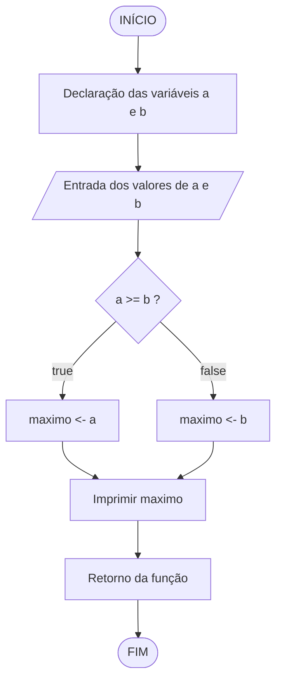

<table>
<tr>
<td align="left" width="8000">
  <small>Introdução à Programação > Conteúdo</small>
</td>
<td align="right">
  <small>Atualizado&nbsp;em:&nbsp;09/04/2022</small>
</td>
</tr>
</table>

<br>

<h1 align="center">
  Comando Ternário ( ? : )
</h1>
<h4 align="center">
Prof. Eduardo Ono
</h4>

<br>

## Conceitos

> O comando ternário (` ? : `) é normalmente utilizado quando uma variável deve receber um dentre dois valores possíveis, resultado de um teste booleano.

Exemplo: Instrução que determina o maior entre dois valores.

<table>
<tr>
  <th align="center">Código</th>
  <th align="center">Fluxograma</th>
</tr>

<tr>
<td valign="top">
  <table cellspacing="10" cellpadding="10">
  <tr><td>

```c
int main()
{
  int a, b, maximo;

  scanf("%d%d", &a, &b);
  if (a >= b)
      maximo = a;
  else
      maximo = b;
  printf("Maximo entre %d e %d = %d\n", a, b, maximo);

  return 0;
}
```

  </td></tr>
  <tr><td>

```c
int main()
{
    int a, b, maximo;

    scanf("%d%d", &a, &b);
    maximo = (a >= b) ? a : b;
    printf("Maximo entre %d e %d = %d\n", a, b, maximo);

    return 0;
}
```

  </td></tr>
  </table>
</td>

<td>



</td>
</tr>
</table>

<br>
