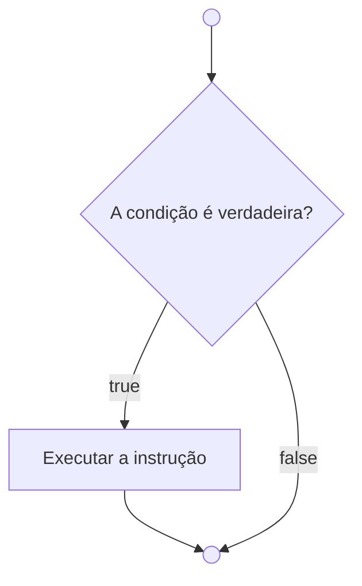
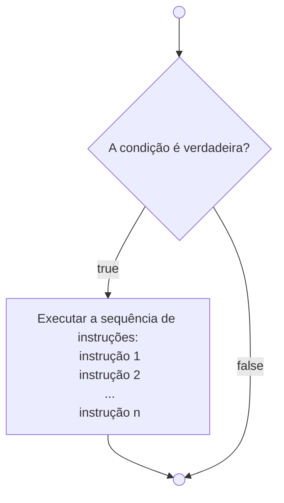
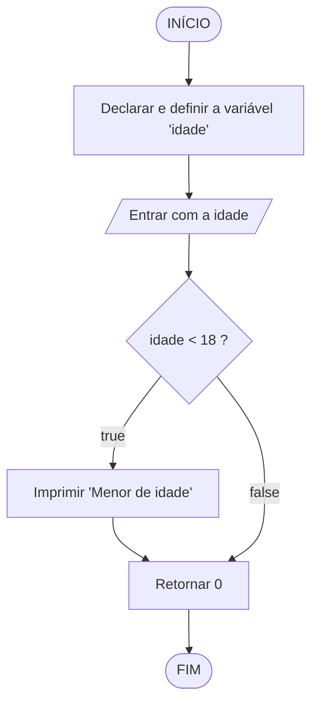

<table>
<tr>
<td align="left" width="8000">
  <small>Introdução à Programação > Conteúdo > Estruturas de Seleção</small>
</td>
<td align="right">
  <small>Atualizado&nbsp;em:&nbsp;10/04/2022</small>
</td>
</tr>
</table>

<br>

<h1 align="center">
if
</h1>
<h4 align="center">
Prof. Eduardo Ono
</h4>

<br>

## Conceitos

<table>
<tr>
  <th>Código em C</th>
  <th>Fluxograma</th>
</tr>

<tr>
<td valign="top">

```c
if (teste_condicional == true)
  instrução;
```

ou 

```c
if (teste_condicional == true)
{
  instrução;
}
```
</td>

<td>



</td>
</tr>

<tr></tr>

<tr>
<td>

```c
if (teste_condicinal == true)
{
  instrução_1;
  instrução_2;
  ...
  instrução_n;
}
```

</td>

<td>



</td>
</tr>
</table>

<br>

## Exemplos

* Verifica se uma pessoa é menor de idade:

<table>
<tr>
  <th>Código em C</th>
  <th>Fluxograma</th>
</tr>
<tr>
<td valign="top">

```c
#include <stdio.h>

int main()
{
    int idade;

    scanf("%d", &idade);
    if (idade < 18)
        printf("Menor de idade.\n");

    return 0;
}
```

</td>

<td>



</td>

</tr>
</table>

<br>
