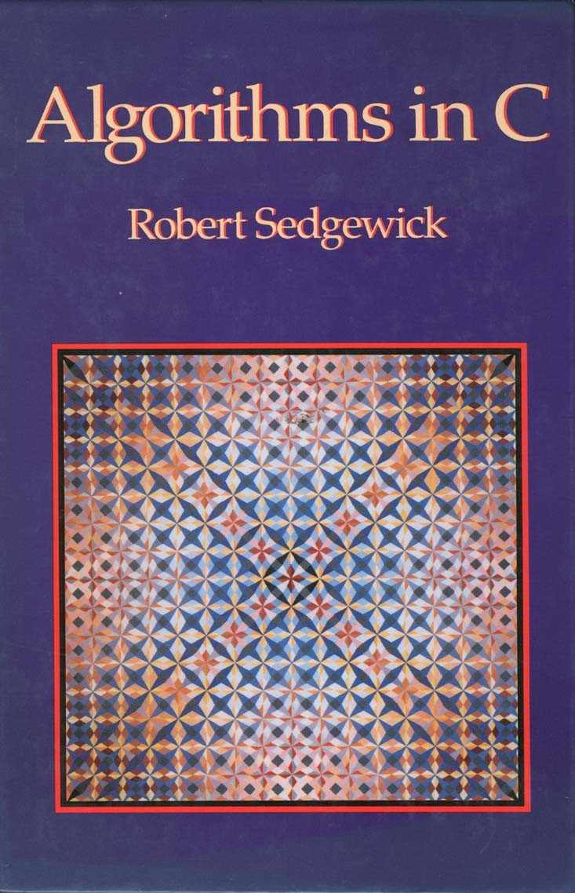

<table>
<tr>
<td align="left" width="8000">
    <small>Introdução à Programação > Conteúdo > Estruturas de Repetição</small>
</td>
<td align="right">
    <small>Atualizado&nbsp;em:&nbsp;17/04/2022</small>
</td>
</tr>
</table>

<br>

<h1 align="center">
Fundamentos
</h1>
<h4 align="center">
Prof. Eduardo Ono
</h4>

<br>

## Tópicos

### Algoritmos Clássicos

* #### Algoritmo de Euclides para a determinação do MDC (Máximo Divisor Comum)

> O Algoritmo de Euclides é baseado no fato de que se _u_ é maior que _v_, então, o MDC entre _u_ e _v_ é o mesmo que o MDC entre _v_ e _u - v_.

<p align="right"><sup><a href="#SEDGEWICK_1990">SEDGEWICK_1990</a>, adaptado.</sup></p>

  * Implementação em linguagem C:

```c
// [SEDGEWICK_1990, adaptado]

#include <stdio.h>

int main()
{
    int a, b, aux, x, mdc;

    printf("Entre com os valores de a e b: ");
    scanf("%d %d", &a, &b);

    if (a > 0 && b > 0)
    {
        x = a;
        mdc = b;
        while (x > 0)
        {
            if (x < mdc)
            {
                aux = x;
                x = mdc;
                mdc = aux;
            }
            x = x - mdc;
        }
    }

    printf("a = %d, b = %d, mdc(a, b) = %d\n", a , b, mdc);

    return 0;
}
```
<br>

## Referências

| Capa | Descrição |
| :-: | --- |
|  | <sup id="SEDGEWICK_1990">[SEDGEWICK_1990]</sup><br>SEDGEWICK, Robert. [__Algorithms in C__](../../../README.md#SEDGEWICK_1990), Addison-Wesley, 1990.
