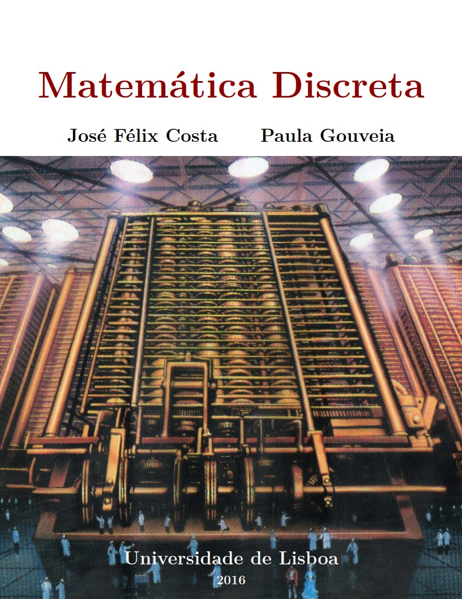

<table>
<tr>
<td align="left" width="8000">
    <small>Introdução à Programação > Conteúdo</small>
</td>
<td align="right">
    <small>Atualizado&nbsp;em:&nbsp;17/04/2022</small>
</td>
</tr>
</table>

 

<h1 align="center">
Estruturas de Repetição
</h1>
<h4 align="center">
Prof. Eduardo Ono
</h4>

 

## Tópicos

* ### Overview

* ### Fundamentos

* ### Comandos de Repetição

  * #### for

  * #### while

  * #### do..while

 

## Referências

| Capa | Descrição |
| :-: | --- |
|  | [COSTA_2016] COSTA, José Félix. <strong>Matemática Discreta</strong>. Universidade de Lisboa, 2016.

 
