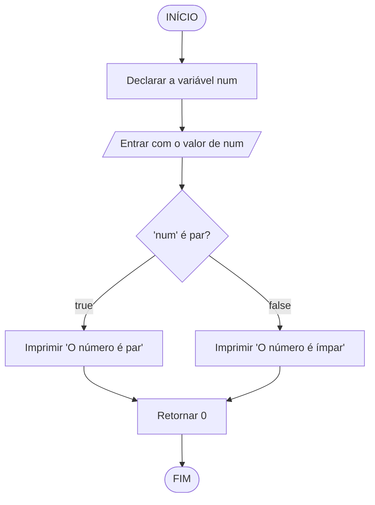

<table>
<tr>
<td align="left" width="8000">
  <small>Introdução à Programação > Conteúdo</small>
</td>
<td align="right">
  <small>Atualizado&nbsp;em:&nbsp;10/04/2022</small>
</td>
</tr>
</table>

<br>

<h1 align="center">
Estrutura de Seleção "if..else"
</h1>
<h4 align="center">
Prof. Eduardo Ono
</h4>

<br>

## Conceitos

> A instrução `if-else` é utilizada quando se quer desviar a execução das instruções mediante um teste booleano.

* Exemplo: Programa que verifica se um número inteiro é par ou ímpar.

<table>
<tr>
  <th>Código em C</th>
  <th>Fluxograma</th>
</tr>

<tr>
<td valign="top">

```c
int main()
{
  int num;

  scanf("%d", &num);
  if (num % 2 == 0)
      printf("O numero e par.\n");
  else
      printf("O numero e impar.\n");

  return 0;
}
```

</td>

<td valign="top">



</td>

</tr>
</table>

<br>
