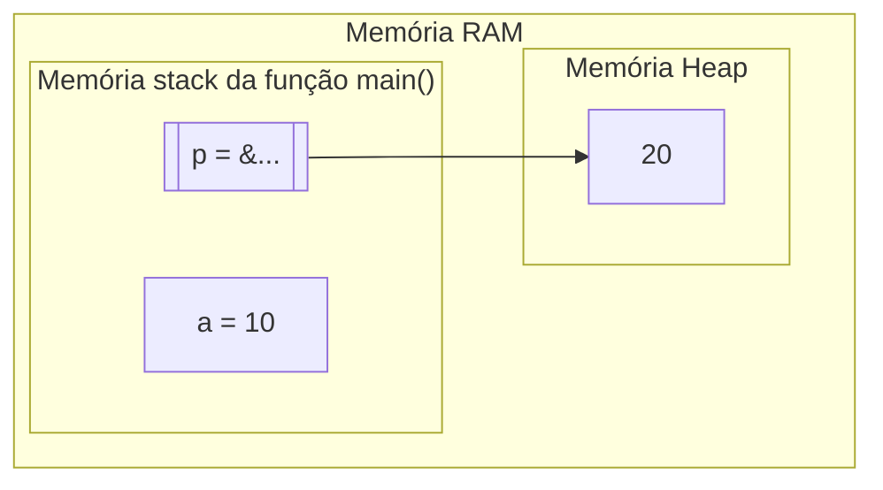

<h1 align="center">Conceitos de Alocação Dinâmica de Memória</h1>

<h4 align="center">Prof. Eduardo Ono</h4>

&nbsp;

## Conceitos

&nbsp;&nbsp;&nbsp;&nbsp;&nbsp;&nbsp;&nbsp;&nbsp;A alocação dinâmica possibilita que o programa utilize toda a memória livre do computador.

&nbsp;

## Exemplo

```c
#include <stdio.h>
#include <stdlib.h> // malloc(), free()

int main()
{
    // Alocação da memória "stack".
    int a = 10; // Alocação estática

    // Espaço alocado para a variável ponteiro p também na memória "stack".
    int *p;
    // Alocação dinâmica da memória "heap".
    p = (int *)malloc(sizeof (int)); // Alocação dinâmica
    // O objeto apontado por "p" recebe o valor 20.
    *p = 20;

    printf("a = %d\n", a); // 10
    printf("Objeto apontado por p = %d\n", *p); // 20

    // Libera o espaço do objeto apontado por "p" na memória "heap".
    free(p);

    return 0;
}
```



&nbsp;
