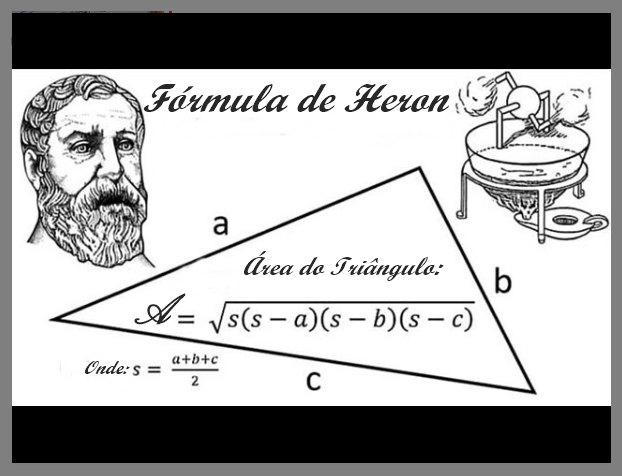

> Introdução à Programação > Listas de Exercícios

# Lista 1 - Fundamentos da Linguagem C

Prof. Eduardo Ono

 

## Exercício 1

* Suponha que um comerciante tenha decidido dar um desconto de 15 % no preço de todos os produtos de sua loja durante um certo período. Após o término do período de descontos, os preços devem retornar aos seus valores normais. Contudo, o comerciante perdeu os preços originais (normais) de todos os seus produtos.  Escreva um programa que, dado o preço de um produto com desconto, calcule e imprima o preço normal do produto.

 

## Exercício 2

* Escreva um programa que calcule e imprima a raiz quadrada de 65. Dica: Utilize a função matemática `sqrt()`, definida na biblioteca `<math.h>`.

 

## Exercício 3

* Escreva um programa que calcule e imprima a raiz cúbica de 65. Dica: Utilize a função matemática `pow()`, definida na biblioteca `<math.h>`.

 

## Exercício 4

* O volume de uma esfera de raio R é dado por V = 4/3 x PI x R^3. Considerando PI = 3.1416, escreva um programa que calcule e imprima o volume de esferas de raios R = 1, R = 5 e R = 10. Dica: Utilize a função matemática `pow()`, definida na biblioteca `<math.h>`.

 

## Exercício 5

&nbsp;&nbsp;&nbsp;&nbsp;A _fórmula de Heron_ (ou _Herão_) determina a área de um triângulo qualquer e é bastante utilizada na prática, pois ela depende somente das medidas dos lados _a_, _b_ e _c_ do triângulo. A fórmula de Heron é dada por:

<em>área</em> = &radic;[<em>s</em>&sdot;(<em>s</em> - <em>a</em>)&sdot;(<em>s</em> - <em>b</em>)&sdot;(<em>s</em> - <em>c</em>)]

onde _s_ é o semi-perímetro do triângulo:

<em>s</em> = (<em>a</em> + <em>b</em> + <em>c</em>) / 2

Escreva um programa em C que peça ao usuário entrar com os três lados de um triângulo qualquer. O programa deverá calcular e imprimir a área do triângulo através da fórmula de Heron.
