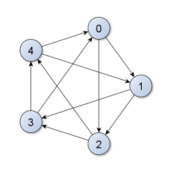

> Introdução à Programação > Listas de Exercícios

<h1 align="center">
Lista 2 - Lógica Matemática
</h1>
<h4 align="center">
Prof. Eduardo Ono
</h4>

<br>

## Exercício 1

* Dados o dividendo e o divisor (números inteiros), escreva uma única instrução em linguagem C que determine o resto da divisão do dividendo pelo divisor.

<details>
  <summary>Solução</summary>

```c
resto = dividendo - divisor * (dividendo / divisor);
```

</details>

<br>

## Exercício 2

* A brincadeira de "Pedra, Papel e Tesoura" é bastante antiga e muito conhecida. Porém, é possível aproveitar a ideia dessa brincadeira na criação de um novo joguinho de computador com cinco opções e não apenas três. Nesse joguinho, um jogador escolhe uma "mão" entre cinco opções, que serão representadas pelos números 0, 1, 2, 3 e 4 e o outro jogador escolhe uma outra "mão". A figura a seguir define as regras de quem será o vencedor. Por exemplo, se um jogador escolher o núemro e e o outro jogador escolher o número 2, o vencedor será o jogador que escolheu o número 2, pois existe na figura uma seta no sentido de 2 para 4.

<p align="center">
  
</p>

Escreva um programa em linguagem C que receba dois números inteiros representando as duas "mãos" escolhidas pelos jogadores. O programa deverá imprimir o número representando a "mão" do jogador vencendor. Casos os jogadores escolham a mesma "mão", o programa deverá escrever "empate".

Exemplos:

| Entrada | Saída |
| :-: | :-: |
| 2 &nbsp; 4 | 2
| 3 &nbsp; 1 | 1
| 0 &nbsp; 2 | 0
| 3 &nbsp; 3 | empate

<details>
  <summary>Solução</summary>

```c
#include <stdio.h>

int main()
{
    int a, b;

    printf("Entre com as duas \"maos\": ");
    scanf("%d%d", &a, &b);

    // Validação da entrada
    if ((a < 0 || a > 4 || b < 0 || b > 4))
    {
        printf("Valores invalidos!\n");
        return 1;
    }

    if (a == b)
        printf("empate\n");
    else if (b == ((a + 1) % 5) || b == ((a + 2) % 5))
        printf("%d\n", a);
    else 
        printf("%d\n", b); 

    return 0;
}
```

</details>

<br>
