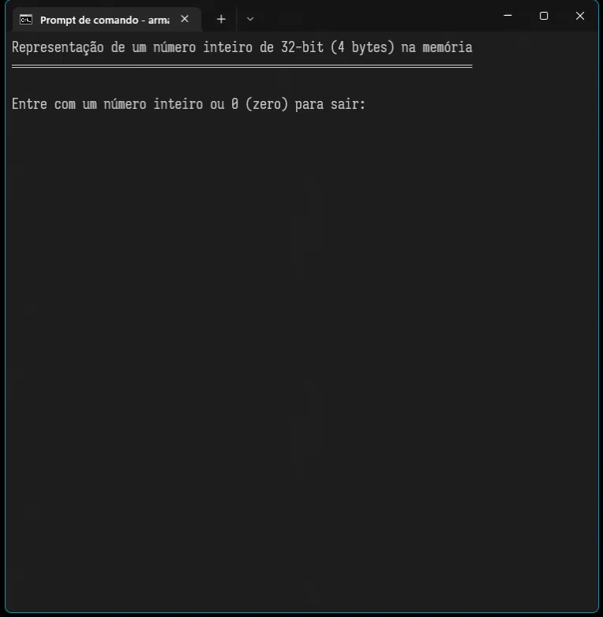
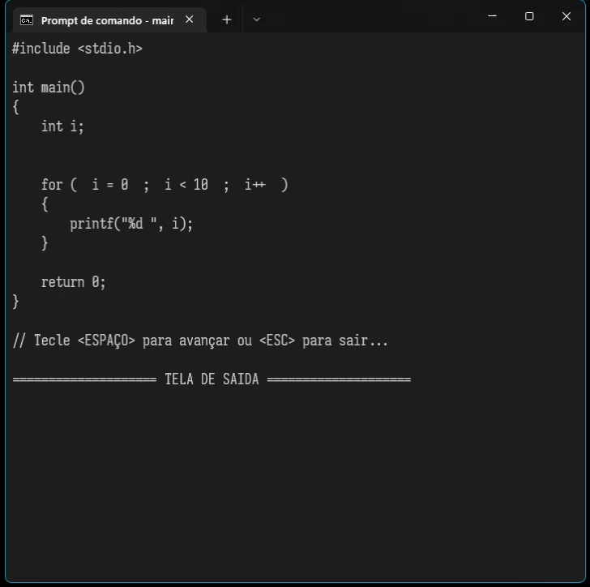
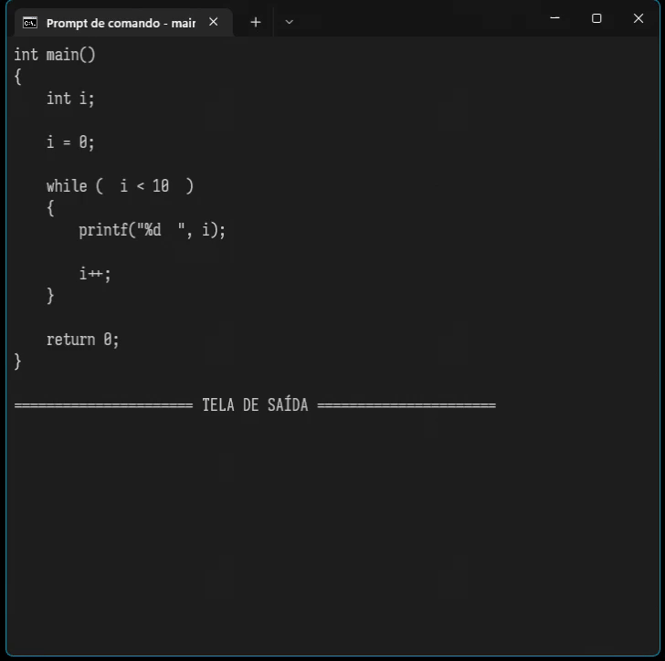

<table>
<tr>
<td align="left" width="8000">
  <small>Introdução à Programação</small>
</td>
<td align="right">
  <small>Atualizado&nbsp;em:&nbsp;01/05/2022</small>
</td>
</tr>
</table>

 

<h1 align="center">
Projetos em Linguagem C
</h1>
<h4 align="center">
Prof. Eduardo Ono
</h4>

 

## Animações no Console

| Projeto | Descrição | Preview
| --- | --- | :-: |
| [Conversor Decimal-Binário](./conversor-decimal-binario/) | Conversor decimal para binário de 32-bit com representação na memória. | 
| [Animação de Instruções "_for_"](./simulador-for/) | Simula a execução de instruções "_for_". Para fins didáticos. | 
| [Animação de Instruções "_while_"](./simulador-for/) | Simula a execução de instruções "_while_". Para fins didáticos. | 

 
