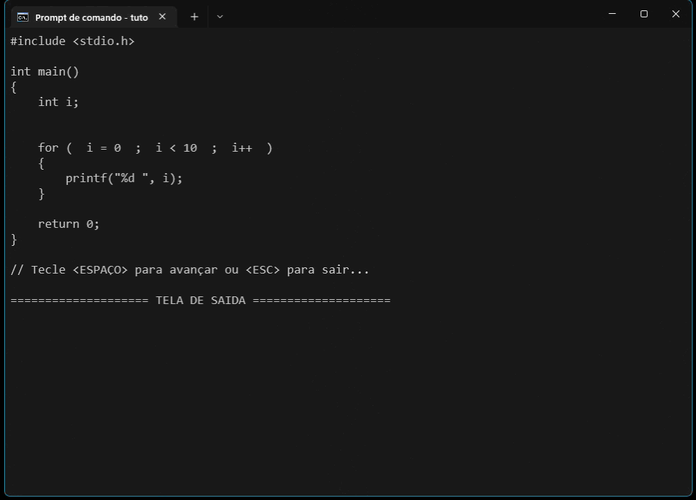

<table>
<tr>
<td align="left" width="8000">
  <small>Introdução à Programação</small>
</td>
<td align="right">
  <small>Atualizado&nbsp;em:&nbsp;24/04/2022</small>
</td>
</tr>
</table>

 

<h1 align="center">
Projetos em Linguagem C
</h1>
<h4 align="center">
Prof. Eduardo Ono
</h4>

 

| Projeto | Descrição | Preview
| --- | --- | :-: |
| [turorial-for](./tutorial-for/) | Simulador de execução da instrução `for`. Somente para fins didáticos. | 

 
